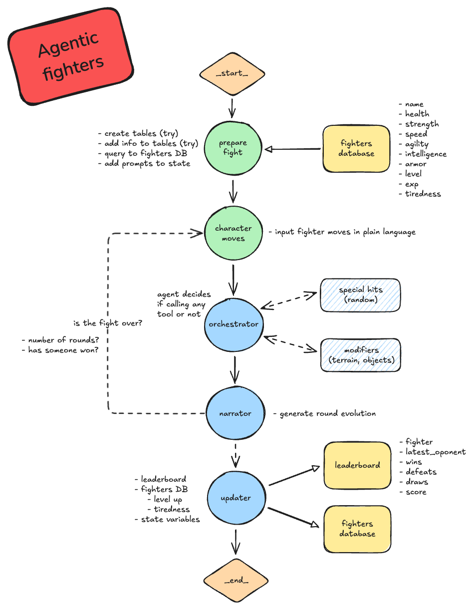

# Agentic Fighters

## Intro

Let's try to create an agentic architecture to generate a fight, having the generation of the fight made by an LLM!

## What are agents?

Un agente es un sistema que percibe su entorno, toma decisiones y emprende acciones de forma autónoma.

En lugar de programar un flujo de control fijo, a veces queremos sistemas LLM que puedan elegir su propio flujo de control para resolver problemas más complejos:

- un LLM puede decidir entre dos rutas potenciales
- un LLM puede decidir a cuál de las muchas herramientas llamar
- un LLM puede decidir si la respuesta generada es suficiente o si se necesita más trabajo

## Table of contents

| Content    | Time estimate | Description
| -------- | ------- | ------- |
|     Exercise 0     | 10 minutes   | Getting your python environment ready |
|     Exercise 1     | 10 minutes   | LangChain basics |
|     Exercise 2     | 10 minutes   | Creating our own agent |
|     Exercise 3     | 20 minutes   | LangGraph for simplicity |
|     Exercise 4     | 40 minutes   | Architectures |
|     Exercise 5     | ¿?¿?¿?¿?   | Going further... **AGENTIC FIGHTERS!** |

## Pre-requisites

#### Hardware / Software

- A Python 3.11 environment
- Jupyter notebooks (Google Colab works)

#### Knowledge

- Python
- Basic SQL
